# Image Stippling

A fast lightweight implement of image stippling base on lightweight libs : [jcv_voronoi](https://github.com/JCash/voronoi), stb, eigen.

## Denpendencies
- eigen
- stb
- [voronoi](https://github.com/JCash/voronoi)

|                           |                                                         |      |
| ------------------------------------------------ | ------------------------------------------------------- | ---- |
| 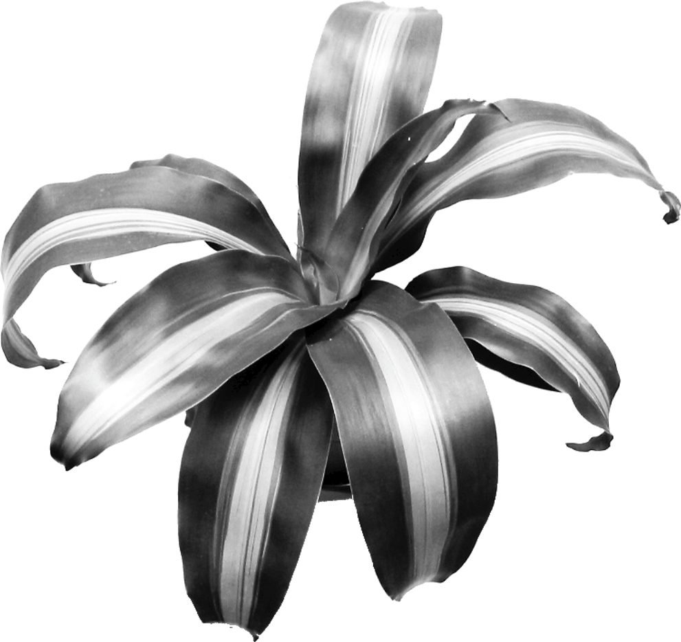  | 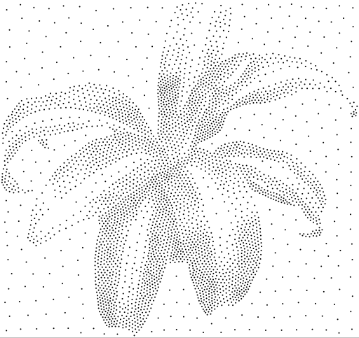  | 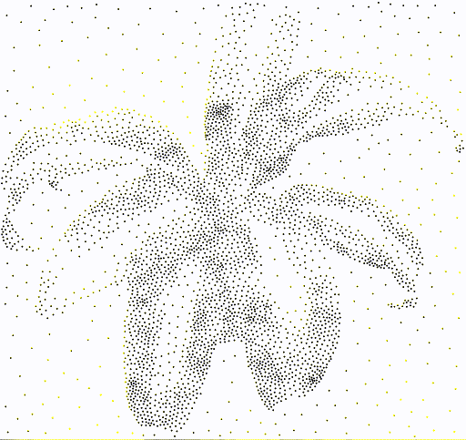      |
| 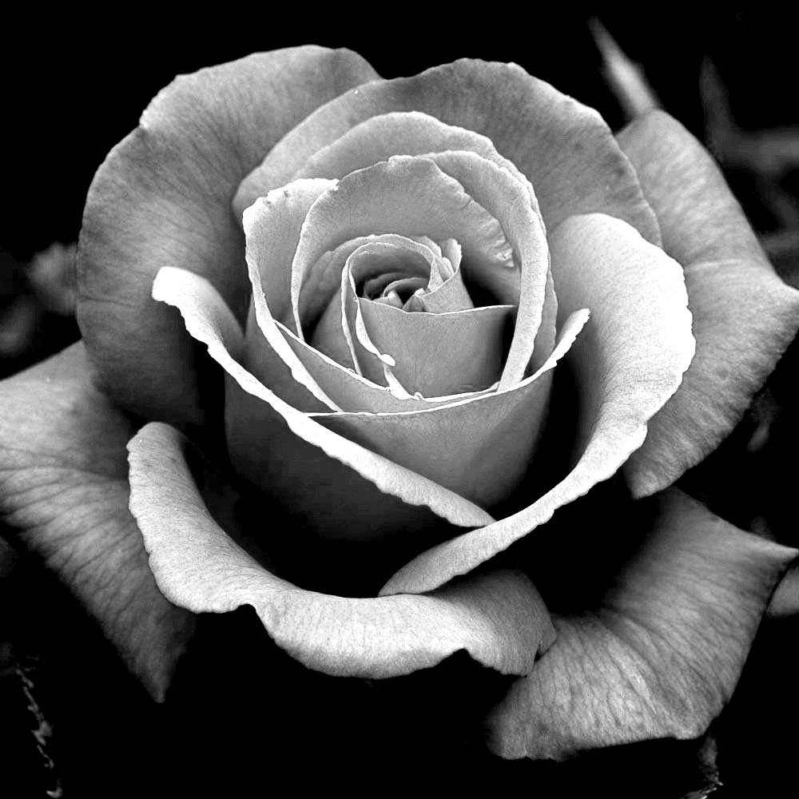      | 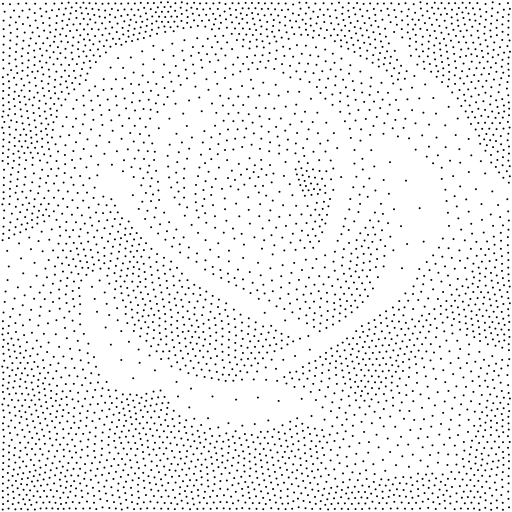      | 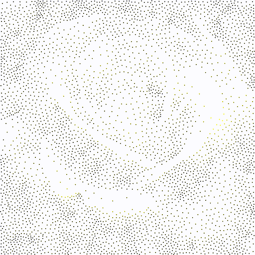      |
|      | 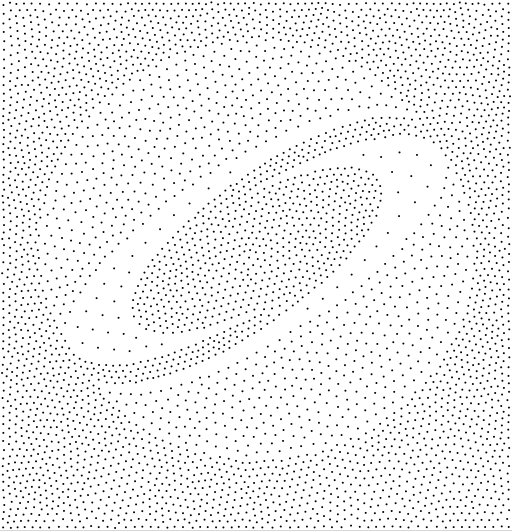     | 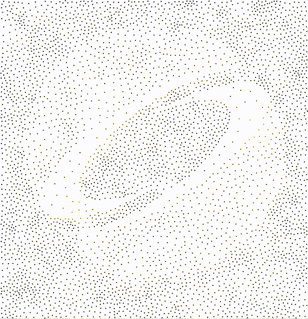      |
|        | 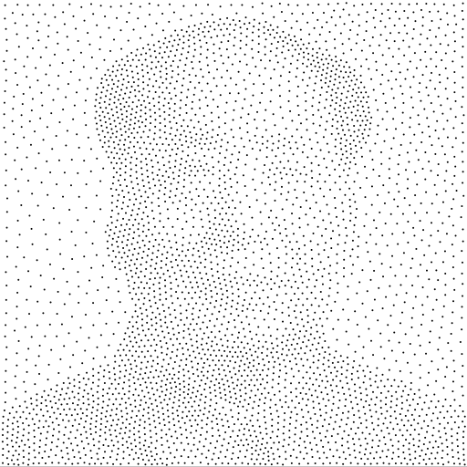       | 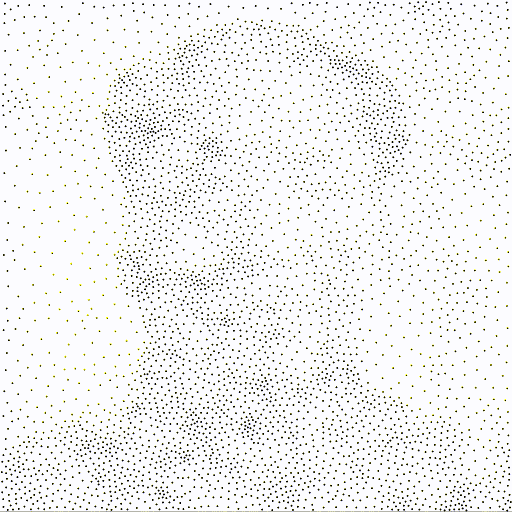      |
|  | 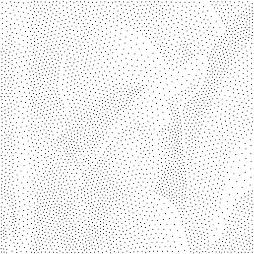 | 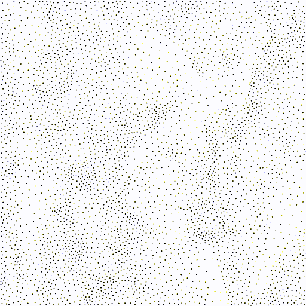      |
